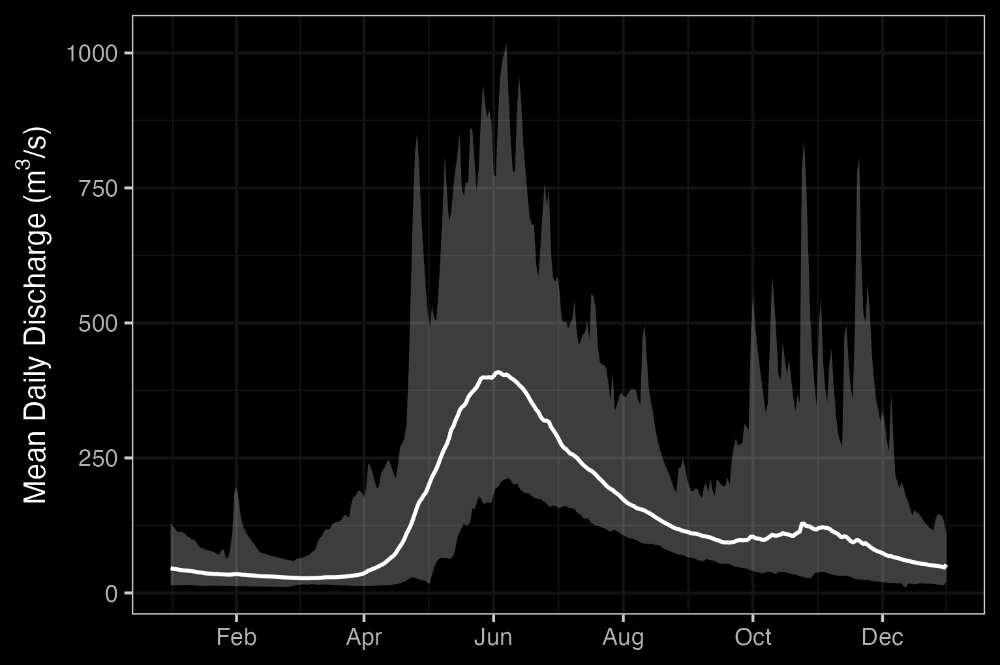
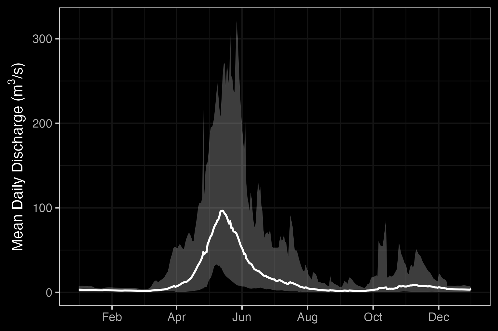
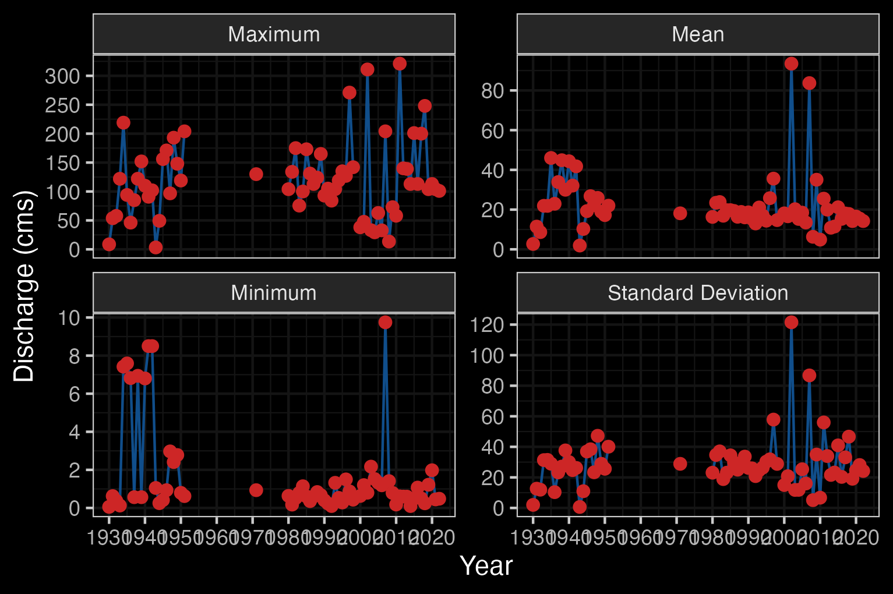
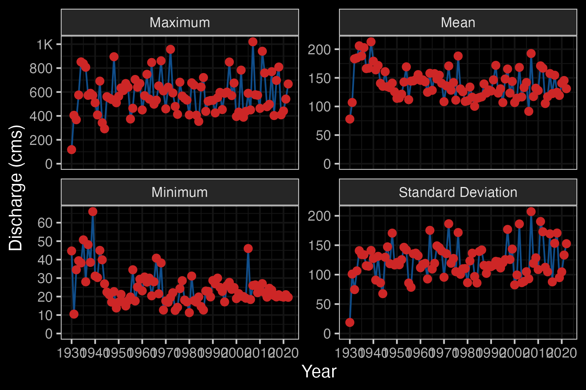
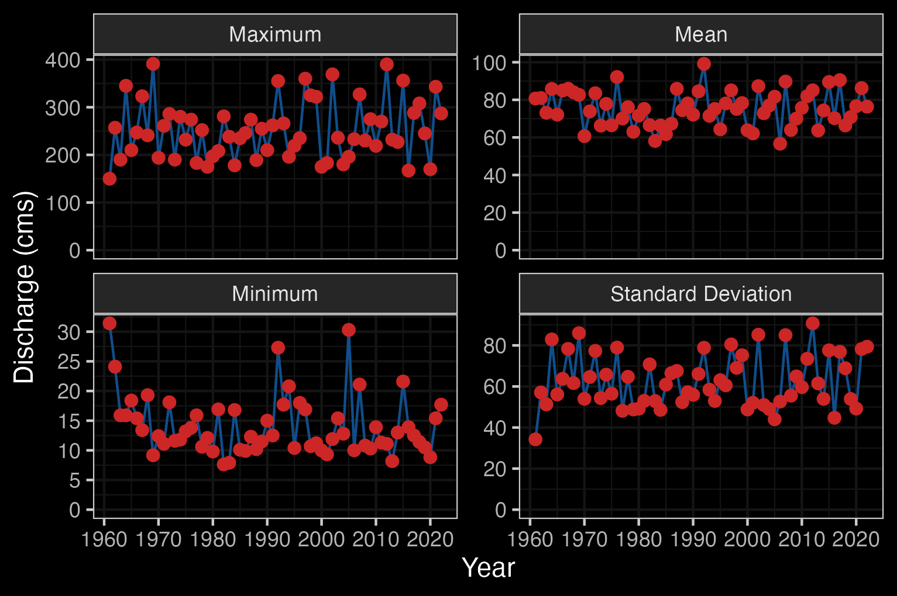

# Introduction

## Wet'suwet'en

Wet'suwet'en hereditary territory covers an area of 22,000km^2^ including the Bulkley River watershed, Zymoetz River watershed, Morice River watershed and portions of the Nechako River watershed. The Wet'suwet'en people are a matrilineal society organized into the Gilseyhu (Big Frog), Laksilyu (Small Frog), Tsayu (Beaver clan), Gitdumden (Wolf/Bear) and Laksamshu (Fireweed) clans. Within each of the clans there are are a number of kin-based groups known as Yikhs or House groups. The Yikh is a partnership between the people and the territory. Thirteen Yikhs with Hereditary Chiefs manage a total of 38 distinct territories upon which they have jurisdiction. Within a clan, the head Chief is entrusted with the stewardship of the House territory to ensure the Land is managed in a sustainable manner. Inuk Nu'at'en (Wet'suwet'en law) governing the harvesting of fish within their lands are based on values founded on thousands of years of social, subsistence and environmental dynamics. The Yintahk (Land) is the centre of life as well as culture and it's management is intended to provide security for sustaining salmon, wildlife, and natural foods to ensure the health and well-being of the Wet'suwet'en [@officeofthewetsuweten2013Wetsuweta; @OfficeWetsuwet2021; @flnrord2017NaturalResourcea]. There are a total of six first nation bands that encompass the Wet'suwet'en. These are: Wet'suwet'en, Ts'il Kaz Koh, Hagwilget Village, Nee-Tahi-Buhn Band, Skin Tyee and Witset [@Wetsuweten2022a].

## Upper Bulkley Riverscape

```{r, eval= FALSE}
hydat_stations <- fpr::fpr_db_query(query = fpr_dbq_clip_local('whse_environmental_monitoring.envcan_hydrometric_stn_sp',
'whse_basemapping.fwa_watershed_groups_poly', 'watershed_group_code', c("BULK", "MORR")))

hydat_stations <- hydat_stations %>% 
  dplyr::filter(station_operating_status == "ACTIVE-REALTIME")
```


```{r hydrology-plots, fig.cap = 'Hydrograph for Bulkley River at Quick (Station #08EE004) and near Houston (Station #08EE003).', fig.show="hold", out.width= c("49.5%","1%","49.5%"), eval=T}

knitr::include_graphics("fig/pixel.png")

```


```{r, eval=TRUE}
fpr_create_hydrograph_local("08EE003", start_year = 1980)
```

```{r pane-hydat-08EE003, fig.cap = "Bulkley River Near Houston (Station #08EE003 - Lat 54.39938 Lon -126.71941). Available daily discharge data from 1980 to 2022."}

```


```{r, eval=TRUE}
fpr_create_hydrograph_local("08EE004")
```

```{r pane-hydat-08EE004, fig.cap = "Bulkley River At Quick (Station #08EE004 - Lat 54.61861 Lon -126.89997). Available daily discharge data from 1930 to 2022."}


```


```{r, eval=TRUE}
fpr_create_hydrograph_local("08ED002")
```

```{r pane-hydat-08ED002, fig.cap = " Morice River Near Houston (Station #08ED002 - Lat 54.11683 Lon -127.42658). Available daily discharge data from 1961 to 2022."}


```


## Project Location

```{r overview-map, fig.cap = 'Overview map of Study Areas',eval=T}
knitr::include_graphics("fig/nge-icon_name.png")
```

