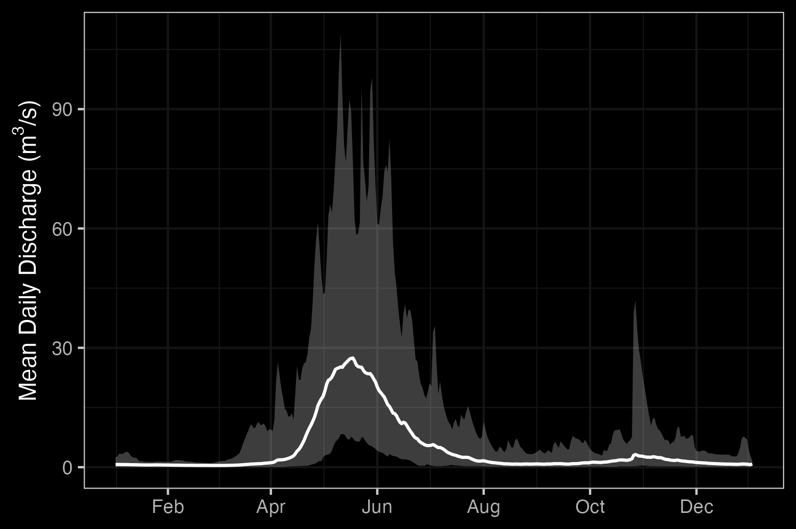
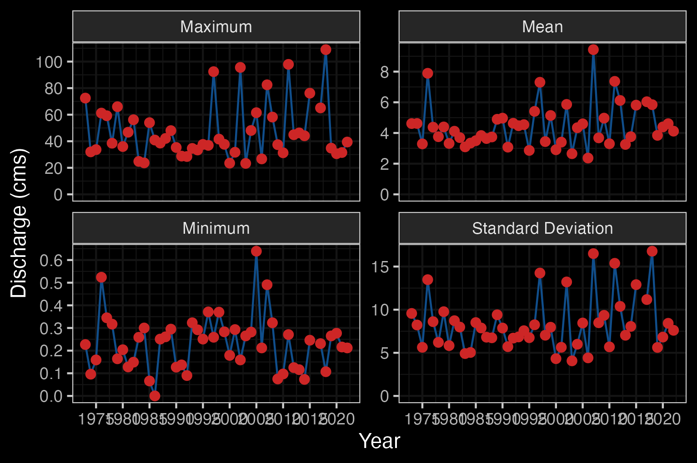
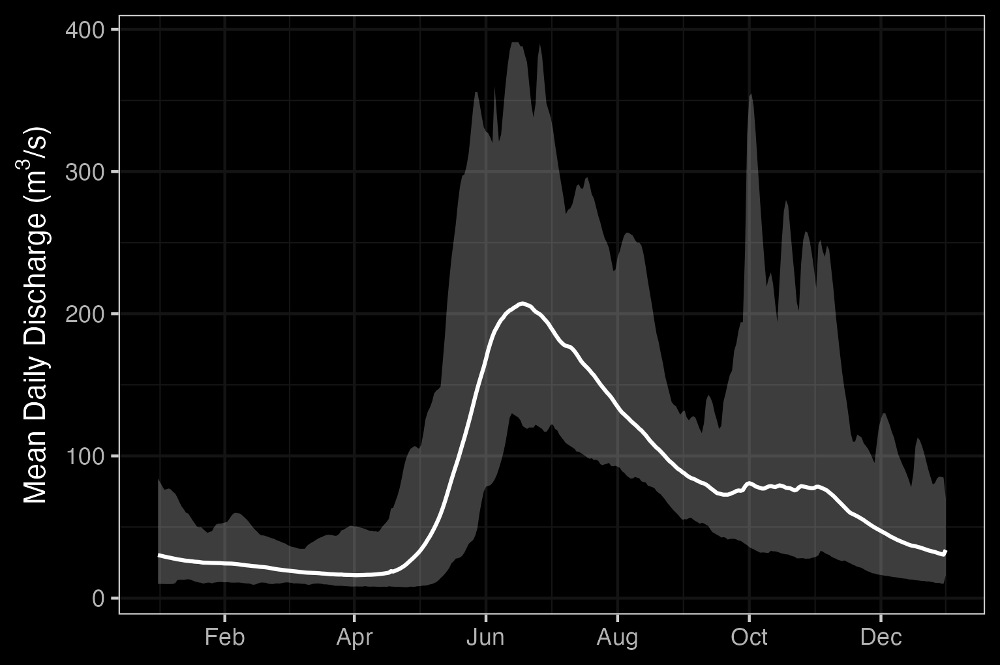

# Background

## Project Location

The study area primarily focuses on the Neexdzii Kwah (Upper Bulkley River), which is located upstream of the confluence of the Widzin Kwah (Morice River) and the Neexdzii Kwah rivers.  Although this area is the initial focus of activities, the overall area for project activities can include anywhere within the boundaries of the Widzin Kwah Water Sustainability Project.  The boundaries of the Widzin Kwah Water Sustainability Project include not only the Neexdzii Kwah but also the entire drainage area of Widzin Kwah (Morice River) as well as the small portion of the Bulkley River downstream of the Morice River confluence to just north of Dockrill Creek [@WidzinKwahWaterSustainabilityProject]. 

```{r overview-map, fig.cap = 'Overview map of Widzin Kwah Study Area',eval=F}
knitr::include_graphics("fig/OW_2024_bulk.png")
```

### Neexdzii Kwah (Upper Bulkley River)

The Neexdzii Kwah (Upper Bulkley River) is an 8th order stream that drains an area of `r fwapgr::fwa_watershed_at_measure(360873822, 164920) %>% mutate(area_km2 = round(area_ha/100, 1)) %>% pull(area_km2)` km^2^ in a generally northerly direction from Bulkley Lake on the Nechako Plateau to its confluence with the Widzin Kwah (Morice River) near Houston [@WidzinKwahWaterSustainabilityProject]. It has a mean annual discharge of `r round(fasstr::calc_longterm_mean(station_number = "08EE003")$LTMAD,1)` m^3^/s at station 08EE003 located near Houston. The hydrograph peaks around May - June during the spring freshet with additional peaks related to significant rain events (Figures \@ref(fig:hydrograph1) and \@ref(fig:hydrology-stats1))[@westcott2022UpperBulkley]. Highway 16 and the CN Railroad parallel the upper Bulkley River and pass through the towns of Topley and Houston.

```{r, hydrometric-get-stations, eval= FALSE}
hydat_stations <- fpr::fpr_db_query(query = lfpr_dbq_clip('whse_environmental_monitoring.envcan_hydrometric_stn_sp',
'whse_basemapping.fwa_watershed_groups_poly', 'watershed_group_code', c("BULK", "MORR")))

hydat_stations_active <- hydat_stations %>% 
  dplyr::filter(station_operating_status == "ACTIVE-REALTIME")
```

```{r, hydrograph-create-01, eval=FALSE}
lfpr_create_hydrograph("08EE003", start_year = 1980)
```

```{r hydrograph1, fig.cap = 'Bulkley River Near Houston (Station #08EE003 - Lat 54.39938 Lon -126.71941). Available mean daily discharge data from 1980 to 2022.', eval=T}
knitr::include_graphics("fig/hydrograph_08EE003.png")
```

```{r hydrology-stats1, fig.cap = "Bulkley River Near Houston (Station #08EE003 - Lat 54.39938 Lon -126.71941). Available daily discharge data from 1980 to 2022."}
knitr::include_graphics("fig/hydrology_stats_08EE003.png")
```

### Buck Creek

Buck Creek is a 5th order stream which enters Neexdzii Kwah just upstream of the Wedzin Kwa / Neexdzii Kwah (Morice/Bulkley) confluence adjacent to Houston.  The watershed drains an area of `r fwapgr::fwa_watershed_at_measure(360886221) %>% mutate(area_km2 = round(area_ha/100, 1)) %>% pull(area_km2)` km^2^. Buck Creek is one of the main tributaries to the Neexdzii Kwah and has a mean annual discharge of `r round(fasstr::calc_longterm_mean(station_number = "08EE013")$LTMAD,1)` m^3^/s at station 08EE013 located near the Houston Medical Centre approximately 1 km upstream of the mouth [@westcott2022UpperBulkley]. Flows from Buck Creek account for just under 1/3 of the total flows in Neexdzii Kwah. The hydrograph for Buck Creek shows a similar pattern to Neexdzii Kwah with peak flows in May - June (Figures \@ref(fig:hydrograph2) and \@ref(fig:hydrology-stats2)).

```{r, hydrograph-create-02, eval=TRUE}
lfpr_create_hydrograph("08EE013")
```

```{r hydrograph2, fig.cap = 'Buck Creek at the confluence with the Neexdzii Kwah (Station #08EE013 - Lat 54.39608 Lon -126.65024). Available mean daily discharge data from 1973 to 2022.', eval=T}

```

```{r hydrology-stats2, fig.cap = "Buck Creek at the confluence with the Neexdzii Kwah (Station #08EE013 - Lat 54.39608 Lon -126.65024). Available daily discharge data from 1973 to 2022."}

```


```{r hydrometric-get-3, eval = FALSE}
# McQuarrie Creek is a 5th order stream that flows into the Upper Bulkley River \~20 km upstream of Houston, and drains an area of `r fwapgr::fwa_watershed_at_measure(360875378) %>% mutate(area_km2 = round(area_ha/100, 1)) %>% pull(area_km2)` km^2^. There is one hydrometric station on McQuarrie Creek deployed by the BC Ministry of Forests, Land, Natural Resource Operations and Rural Development Groundwater Program (FLNRORD) which was was active from 2016-2018 but has very few data [@westcott2022UpperBulkley]. An estimate of mean annual discharge for the two years of available data is `r round(fasstr::calc_longterm_mean(mq_clean),1)` m^3^/s at station 08EE0002 located near the mouth of the creek. Based of the limited data, the hydrograph for McQuarrie Creek during this time period peaks rapidly in May and again in the winter (Figures \@ref(fig:hydrograph3)).
### McQuarrie Creek
#McQuarrie Creek, station number 08EE0002, but station not part of hydat database
mq <- read.csv("data/hydrometric/DataSetExport-Discharge.Logger@08EE0002-20240308164919.csv")

mq_clean <- mq %>%
  janitor::row_to_names(2) %>%
  janitor::clean_names() %>%
  select(-event_timestamp_utc_08_00)%>%
  rename(Value = value_m_3_s) %>%
  mutate(Value = as.numeric(Value)) %>%
  mutate(timestamp_utc_08_00 = lubridate::ymd_hms(timestamp_utc_08_00)) %>%
  mutate(Date = lubridate::date(timestamp_utc_08_00)) %>%
  mutate(time = format(timestamp_utc_08_00, "%H:%M:%S"))

start_year <- mq_clean$Date %>% min() %>% lubridate::year()
end_year <- mq_clean$Date %>% max() %>% lubridate::year()
```

```{r, hydrometric-tidy3, eval = FALSE}
#Manually creating hydrograph for McQuarrie Creek, station 08EE0002, because station not part of hydat database.

flow <- mq_clean %>%
  dplyr::mutate(day_of_year = yday(Date)) %>%
  dplyr::group_by(day_of_year) %>%
  dplyr::summarise(daily_ave = mean(Value, na.rm=TRUE),
                   daily_sd = sd(Value, na.rm = TRUE),
                   max = max(Value, na.rm = TRUE),
                   min = min(Value, na.rm = TRUE)) %>%
  dplyr::mutate(Date = as.Date(day_of_year))

plot <- ggplot2::ggplot()+
  ggplot2::geom_ribbon(data = flow, aes(x = Date, ymax = max,
                                        ymin = min),
                       alpha = 0.3, linetype = 1)+
  ggplot2::scale_x_date(date_labels = "%b", date_breaks = "2 month") +
  ggplot2::labs(x = NULL, y = expression(paste("Mean Daily Discharge (", m^3, "/s)", sep="")))+
  ggdark::dark_theme_bw() +
  ggplot2::geom_line(data = flow, aes(x = Date, y = daily_ave),
                     linetype = 1, linewidth = 0.7) +
  ggplot2::scale_colour_manual(values = c("grey10", "red"))
plot

ggplot2::ggsave(plot = plot, file=paste0("fig/hydrograph_", "08EE0002", ".png"),
                h=3.4, w=5.11, units="in", dpi=300)
```

```{r hydrograph3, fig.cap = 'Hydrograph for McQuarrie Creek above Hwy 16 Culvert (Station #08EE0002 - Lat 54.51572 Lon -126.46606). Available mean daily discharge data from 2016 to 2018).', eval=FALSE}
knitr::include_graphics("fig/hydrograph_08EE0002.png")
```

```{r}
### Widzin Kwah (Morice River)

# The Widzin Kwah (Morice River) watershed drains `r fwapgr::fwa_watershed_at_measure(360885316) %>% mutate(area_km2 = round(area_ha/100, 1)) %>% pull(area_km2)` km^2^ of Coast Mountains and Interior Plateau in a generally south-eastern direction. The Morice River is an 8th order stream that flows approximatley 80km from Widzin Bin (Morice Lake) to the confluence with the upper Bulkley River just north of Houston. Major tributaries include the Nanika River, the Atna River, Gosnell Creek and the Thautil River. There area numerous large lakes situated on the south side of the watershed including Morice Lake, McBride Lake, Stepp Lake, Nanika Lake, Kid Price Lake, Owen Lake and others. There is one active hydrometric station on the mainstem of the Morice River near the outlet of Morice Lake and one historic station that was located at the mouth of the river near Houston that gathered data in 1971 only [@canada2010NationalWater]. An estimate of mean annual discharge for the one year of data available for the Morice near it's confluence with the Bulkley River is `r round(fasstr::calc_longterm_mean(station_number = "08ED003")$LTMAD,1)` m^3^/s. Mean annual discharge is estimated at `r round(fasstr::calc_longterm_mean(station_number = "08ED002")$LTMAD,1)` m^3^/s at station 08ED002 located near the outlet of Morice Lake. Flow patterns are typical of high elevation watersheds influenced by coastal weather patterns which receive large amounts of winter precipitation as snow in the winter and large precipitation events in the fall. This leads to peak levels of discharge during snowmelt, typically from May to July with isolated high flows related to rain and rain on snow events common in the fall (Figures \@ref(fig:hydrograph4) - \@ref(fig:hydrology-stats4)).
# 
# ```{r, eval=TRUE}
# lfpr_create_hydrograph("08ED002")
```

```{r hydrograph4, fig.cap = " Outlet of Morice Lake (Station #08ED002 - Lat 54.11683 Lon -127.42658). Available mean daily discharge data from 1961 to 2022.", eval = FALSE}


```

```{r hydrology-stats4, fig.cap = " Outlet of Morice Lake (Station #08ED002 - Lat 54.11683 Lon -127.42658). Available daily discharge data from 1961 to 2022.", eval = FALSE}

knitr::include_graphics("fig/hydrology_stats_08ED002.png")
```


## Fisheries

### Neexdzii Kwah

Traditionally, the salmon stocks passing through and spawning in the greater Bulkley River were the principal food source for the Gitxsan and Wet’suwet’en people living there [@wilsonFishPassageAssessment2007].  Anadromous lamprey passing through and spawning in the upper Neexdzii Kwah were traditionally also an important food source for the Wet'suwet'en (@gottesfeld_rabnett2007SkeenaFish; pers comm. Mike Ridsdale, Environmental Assessment Coordinator, Office of the Wet'suwet'en).  @gottesfeld_rabnett2007SkeenaFish report sourceing information from @departmentoffisheriesandoceans1991Fishhabitat that principal spawning areas for chinook in the Neexdzii Kwah include the mainstem above and below Buck and McQuarrie Creeks, between Cesford and Watson Creeks, and the reaches upstream and downstream of Bulkley Falls.

<br>

Renowned as a world class recreational steelhead and coho fishery, the greater Bulkley River downstream of Neexdzii Kwah receives some of the heaviest angling pressure in the province. In response to longstanding angler concerns with respect to overcrowding, quality of experience and conflict amongst anglers, an Angling Management Plan was drafted for the river following the initiation of the Skeena Quality Waters Strategy process in 2006 and an extensive multi-year consultation process. The plan introduces a number of regulatory measures with the intent to provide Canadian resident anglers with quality steelhead fishing opportunities. Regulatory measures introduced with the Angling Management Plan include prohibited angling for non-guided non-resident aliens on Saturdays and Sundays, Sept 1 - Oct 31 within the Bulkley River, angling prohibited for non-guided non-resident aliens on Saturdays and Sundays, all year within the Suskwa River and angling prohibited for non-guided non-resident aliens Sept 1 - Oct 31 in the Telkwa River. The Neexdzii Kwah is considered Class II water and there is no fshing permitted upstream of the Morice/Bulkley River Confluence [@flnroBulkleyRiverAngling2013; @flnroOverviewAnglingManagement2013; @flnrordFreshwaterFishingRegulations2019].

<br>

#### Upper Bulkley Falls

A detailed field assessment and write up regarding the upper Bulkley falls was conducted as part of fish passage restoration in the watershed - is presented in @irvine2021BulkleyRiver with a condensed summary here. The site was assessed on October 28, 2021 by Nallas Nikal, B.i.T, and Chad Lewis, Environmental Technician. The top of the falls is located at 11U.678269.6038266 at an elevation of 697m approximatley 11.3km downstream of Bulkley Lake and upstream of Ailport Creek.  Within the Bulkley River immediately below the 12 - 15m high bedrock falls, channel width was 17.4m and the wetted width was 15.6m. Two channels comprised the falls. The primary channel was 20m long, had a channel/wetted width of 8.5m, a 16% grade and water depths ranging from 35 - 63cm.  The secondary channel was 25m long, with channel/wetted widths of 7.5m, a grade of 12% and water depths ranging from 3 - 13cm [@irvine2021BulkleyRiver].

<br>

@dysonBulkleyFallsInvestigation1949 and @stokesUpperBulkleyRiver1956 report substantial use of habitat above Bulkley Falls by steelhead, chinook, coho and sockeye utilization in the past (pre-1950) based on spawning reports.  Both authors concluded that the Bulkley Falls pose a partial obstruction to migrating fish based on flow levels. Chinook, which migrate early in the summer when water levels are high, have been noted as able to ascend the falls in normal to high water years and in high water years it was thought that coho and steelhead could ascend.  @gottesfeld_rabnett2007SkeenaFish report that the falls are almost completely impassable to all salmon during low water flows.  @stokesUpperBulkleyRiver1956 reports that there was high value spawning habitat located within the first 3km of the Neexdzii Kwah from the outlet of Bulkley Lake.

<br>

@wilsonFishPassageAssessment2007 reported thataApproximately 11.3 km downstream of the Bulkley Lake outlet and just upstream of Watson Creek, the upper Bulkley falls is an approximately 4m high narrow rock sill that crosses the Neexdzii Kwah, producing a steep cascade section. This obstacle to fish passage is recorded as an almost complete barrier to fish passage for salmon during low water flows. @wilsonFishPassageAssessment2007 also reported that coho have not been observed beyond the falls since 1972. 

<br>

#### Traditional Fishing Sites within the Neexdzii Kwah

Traditional fishing areas located within the Neexdzii Kwah as documented by @wilsonFishPassageAssessment2007 are detailed in Table \@ref(tab:tab-hist-sites).


```{r hist-sites-extract, eval=FALSE}
# Extract historical fishing sites
path <- "/Users/airvine/zotero/storage/8SUN8SYA/Wilson and Rabnett - 2007 - Fish Passage Assessment of.pdf"


##define the area to extract table from for first page

#you would run with this the first time
tab_trim <- tabulizer::locate_areas(path, 64)

##since we have done this before though - numbers below are results
 #      top      left    bottom     right 
 # 70.98383  84.16353 407.17779 521.81754
tab_trim <- list(c(70.98383,  84.16353, 407.17779, 521.81754 ))

names_cols <- c('Site Location', 'Tradional Site Name', 'Fish Species')

##extract the tables useing the areas you defined
table_raw <- tabulizer::extract_tables(path,
                                       pages = seq(64,64),
                                        method = "lattice",
                                        area = tab_trim) %>% 
  pluck(1) %>%
  as_tibble() %>% 
  # funky column names so we slice the first row and set them as names
  slice(2:nrow(.)) %>% 
  dplyr::select(1:3) %>% 
  purrr::set_names(names_cols) ##should do this as input from "pages" part of the function

# burn out to csv for safe keeping
table_raw %>% 
  readr::write_csv('data/trad_fish_sites_wilson_rabnett2007FishPassage.csv')
```

```{r tab-hist-sites}
readr::read_csv('data/trad_fish_sites_wilson_rabnett2007FishPassage.csv') %>% 
  dplyr::filter(stringr::str_detect(`Site Location`, "Buck|Maxan|McQuarrie|Bulkley Lake|Hwy.16")) %>% 
  arrange(`Tradional Site Name`) %>% 
  fpr::fpr_kable(caption_text = "Traditional fishing sites in the Neexdzii Kwah.  Adapted from Wilson and Rabnett 2007.",
                 scroll = FALSE)
```

#### Salmon Stock Assessment Data

Fisheries and Oceans Canada stock assessment data was accessed via the [NuSEDS-New Salmon Escapement Database System](https://open.canada.ca/data/en/dataset/c48669a3-045b-400d-b730-48aafe8c5ee6)
through the [Open Government Portal](https://open.canada.ca/en) with results presented in Table \@ref(tab:tab-dfo-sad-tr-neexdzii). A brief memo on the data extraction process is available in the [memos directory](https://github.com/NewGraphEnvironment/restoration_wedzin_kwa_2024/tree/main/memos).


```{r tab-dfo-sad-tr-neexdzii}
dfo_sad_raw <- readr::read_csv('data/inputs_raw/All Areas NuSEDS.csv')
#names(dfo_sad_raw)

dfo_sad_tr <- readr::read_csv('data/inputs_raw/All Areas NuSEDS.csv') %>% 
  dplyr::filter(waterbody == "BULKLEY RIVER - UPPER" | waterbody == "MORICE RIVER") %>% 
  dplyr::filter(!is.na(total_return_to_river)) %>% 
  arrange(species, analysis_yr) %>% 
  dplyr::select(waterbody,
                species, analysis_yr, 
                total_return_to_river, 
                start_spawn_dt_from,
                peak_spawn_dt_from,
                end_spawn_dt_from, 
                accuracy,	
                precision,	
                index_yn,	
                reliability,	
                estimate_stage,	
                estimate_classification,	
                no_inspections_used,	
                estimate_method)

# started looking at GT
# dfo_sad_tr |> 
#   dplyr::filter(waterbody == "BULKLEY RIVER - UPPER") |> 
#   dplyr::select(-waterbody) |>
#   gt::gt() |>
#   gt::tab_options(table.font.size = 10) |> 
#   # gt::opt_interactive(page_size_default = 5, use_filters = TRUE, use_compact_mode = TRUE) |> 
#   gt::tab_caption(caption = md("Fisheries and Oceans Canada stock assessment data for the Bulkley River - Upper.  Data is filtered to only include records with total return to river data."))


dfo_sad_tr %>%
  dplyr::filter(waterbody == "BULKLEY RIVER - UPPER") |>
  dplyr::select(-waterbody) |> 
  fpr::fpr_kable(caption_text = "Fisheries and Oceans Canada stock assessment data for the Bulkley River - Upper.  Data is filtered to only include records with total return to river data.",
                 scroll = gitbook_on)
```

<br>

```{r fig-dfo-sad-tr1, fig.cap = "Fisheries and Oceans Canada stock assessment data for the Bulkley River - Upper.  Data is filtered to only include records with total return to river data.", eval= FALSE}

dfo_sad_raw %>%
  ldfo_sad_plot_line("BULKLEY RIVER - UPPER", "total_return_to_river", "species", "analysis_yr", col_group_exclude = "Coho")
```

<br>

```{r fig-dfo-sad-nad1, fig.cap = "Fisheries and Oceans Canada stock assessment data for the Bulkley River - Upper.  Data is filtered to only include records with natural adult spawners data.", eval = FALSE}

dfo_sad_raw %>%
  ldfo_sad_plot_line("BULKLEY RIVER - UPPER", "natural_adult_spawners", "species", "analysis_yr", col_group_exclude = "Coho")

```


### Morice River

Detailed reviews of Morice River watershed fisheries can be found in @bustardConservingMoriceWatershed2002, @gottesfeldConservingSkeenaFish2002, @schellBriefOverviewFish2003, @gottesfeldSkeenaFishPopulations2007, and @ilmb2007MoriceLanda with a comprehensive review of water quality by @oliverAnalysisWaterQuality2018 Overall, the Morice watershed contains high fisheries values as a major producer of chinook, pink, sockeye, coho and steelhead.

#### Salmon Stock Assessment Data

Fisheries and Oceans Canada stock assessment data was accessed via the [NuSEDS-New Salmon Escapement Database System](https://open.canada.ca/data/en/dataset/c48669a3-045b-400d-b730-48aafe8c5ee6)
through the [Open Government Portal](https://open.canada.ca/en) with results presented in Table \@ref(tab:tab-dfo-sad-tr-morice). A brief memo on the data extraction process is available in the [memos directory](https://github.com/NewGraphEnvironment/restoration_wedzin_kwa_2024/tree/main/memos).

```{r tab-dfo-sad-tr-morice}

dfo_sad_tr %>%
  dplyr::filter(waterbody == "MORICE RIVER") |>
  dplyr::select(-waterbody) |> 
  fpr::fpr_kable(caption_text = "Fisheries and Oceans Canada stock assessment data for the Morice River.  Data is filtered to only include records with total return to river data.",
                 scroll = gitbook_on)


```

```{r fig-dfo-sad-tr2, fig.cap = "Fisheries and Oceans Canada stock assessment data for the Morice River.  Data is filtered to only include records with total return to river data.", eval = FALSE}

#### Salmon Stock Assessment Data

dfo_sad_raw %>%
  ldfo_sad_plot_line("MORICE RIVER", "total_return_to_river", "species", "analysis_yr", col_group_exclude = "Coho", eval = FALSE)

```

```{r fig-dfo-sad-nad2, fig.cap = "Fisheries and Oceans Canada stock assessment data for the Morice River.  Data is filtered to only include records with natural adult spawners data.", eval = FALSE}

dfo_sad_raw %>%
  ldfo_sad_plot_line("MORICE RIVER", "natural_adult_spawners", "species", "analysis_yr", col_group_exclude = "Coho")


```


#### Fish Species

Fish species recorded in the greater Bulkley River and Morice River watershed groups are detailed in Table \@ref(tab:fiss-species-table) [@data_fish_obs]. Summaries of fish species life history, biology, stock status, and traditional use are documented in @schellBriefOverviewFish2003, @wilsonFishPassageAssessment2007, @gottesfeldConservingSkeenaFish2002 and @officeofthewetsuweten2013Wetsuweta. @wilsonFishPassageAssessment2007 discuss chinook, pink, sockeye, coho, steelhead and indigenous freshwater Bulkley River fish stocks within the context of key lower and upper Bulkley River habitats such as the Suskwa River, Station Creek, Harold Price Creek, Telkwa River and Buck Creek. Key areas within the upper Bulkley River watershed with high fishery values, documented in @schellBriefOverviewFish2003, are the upper Bulkley mainstem, Buck Creek, Dungate Creek, Barren Creek, McQuarrie Creek, Byman Creek, Richfield Creek, Johnny David Creek, Aitken Creek and Emerson Creek. Some areas of high fisheries values for chinook, sockeye and coho are noted in @bustardConservingMoriceWatershed2002 as McBride Lake, Nanika Lake, and Morice Lake watersheds. 

```{r extra-morice}
# In the 1990's the Morice River watershed, @gottesfeldSkeenaFishPopulations2007 estimated that chinook comprised 30% of the total Skeena system chinook escapements. It is estimated that Morice River coho comprise approximatley 4% of the Skeena escapement with a declining trend noted since the 1950 in @gottesfeldSkeenaFishPopulations2007 Coho spawn in major tributaries and small streams ideally at locations where downstream dispersal can result in seeding of prime off channel habitats including warm productive sloughs and side channels. Of all the salmon species, coho rely on small tributaries the most [@bustardConservingMoriceWatershed2002]. @bustardConservingMoriceWatershed2002 report that much of the distribution of coho into non-natal tributaries occurs during high flow periods of May - early July with road culverts blocking migration into these habitats.
```


<!-- `r if(gitbook_on){knitr::asis_output("<br>")} else knitr::asis_output("<br><br><br><br>")` -->

```{r fiss-species-table}
fiss_species_table <- readr::read_csv('data/inputs_extracted/fiss_species_table.csv')

fiss_species_table %>% 
  fpr::fpr_kable(caption_text = 'Fish species recorded in the Bulkley River and Morice River watershed groups.', 
                 footnote_text = 'COSEWIC abbreviations : 
                 SC - Special concern 
                 DD - Data deficient
                 NAR - Not at risk
                 E - Endangered
                 T - Threatened
                 
                 BC List definitions : 
                 Yellow - Species that is apparently secure 
                 Blue - Species that is of special concern
                 Exotic - Species that have been moved beyond their natural range as a result of human activity
                 ',
                 scroll = gitbook_on)
```


## Restoration Philosophy

### Process-based Restoration

Process-based restoration is a relatively new approach to river restoration and is based on the understanding that river form and function is driven by the physical, chemical, and biological processes that take place within them [@beechieProcessbasedPrinciplesRestoring2010]. Together, these processes shape rivers and flood planes, which is known as a riverscape [@shahverdian_etal2019ChapterBackground]. The goal of process-based restoration is to restore these processes to their the natural rates and magnitudes (essentially stage 0), which leads to the system restoring itself through biological processes and requires minimal corrective intervention [@ciottiDesignCriteriaProcessBased2021a, @polvi_wohl2013BioticDrivers]. This approach is in contrast to traditional river restoration, which focuses on restoring uniform and static form to the river, such as the channel shape, and is often done through hard engineering and has high costs [@beechieProcessbasedPrinciplesRestoring2010]. Principles of process-based restoration adapted from @beechieProcessbasedPrinciplesRestoring2010 are included in Table \@ref(tab:tab-rest-princ-pb).

```{r tab-rest-princ-pb}
restoration_principles_pb %>% 
  fpr::fpr_kable(caption_text = restoration_principles_pb_caption, scroll = gitbook_on)


```

<br>

Below is an example of process-based restoration using stage 0 methodology done at Deer Creek in Oregon, USA. In this project they filled in incised channels and added large wood to to the river to restore the natural floodplain elevation and re-establish multiple channels (Figure \@ref(fig:deer-creek-plan))[@meyer2018DeerCreek]. Although this project used relatively aggressive restoration techniques, they observed immediate improvements and the benefits were self-sustaining (Figure \@ref(fig:deer-creek-action))[@meyer2018DeerCreek].

```{r deer-creek-plan, fig.cap = 'An example of process-based restoration using stage 0 methodology to restored the natural floodplain elevation. In this project they filled in incised channels and added large wood to restore the natural floodplain elevation and re-establish multiple channels (Meyer, 2018).',eval=T}
knitr::include_graphics("fig/stage0_before_after.png")
```

<br>

```{r deer-creek-action, fig.cap = 'Before and after restoration took place at Deer Creek, USA. They observed imediate improvements to the habitat and the benefits were self-sustaining (Meyer, 2018).',eval=T}
knitr::include_graphics("fig/deer_creek_before_after.png")
```

Process-based restoration also includes many low-cost and low-tech restoration techniques. Resources are sourced from near-by areas, and the restoration is often done by hand, which makes it more accessible to a broad audience and can be done on a smaller scale [@shahverdian_etal2019ChapterBackground]. The primary goal of low-tech restoration is to improve the health of as many riverscapes possible by "letting the system do the work" [@shahverdian_etal2019ChapterBackground].

Low-cost process-based restoration could be an applicable in the Upper Bulkely riverscape. Some examples of low-cost restoration techniques include:

-   Grazing management
-   Riparian planting
-   Post-assisted log structures (PALS)
-   Beaver damn analogs (BDAs)

Further examples of low-cost process-based restoration are available [here](https://lowtechpbr.restoration.usu.edu/workshops/2020/SGI/Modules/module1).


### Stage 0

The Stream Evolution Model (SEM) is used to understanding how the morphology of channels (such as rivers or streams) respond to disturbances like changes in base level, channelization, or alterations in flow and sediment regimes (Figure \@ref(fig:SEM-stages))[@cluer_thorne2014StreamEvolution]. An important features of the SEM is the inclusion of stage 0, which represents the state of the river before disturbances and is categorized as either an anastomosing wet woodland or an anastomosing grassed wetland (Figure \@ref(fig:SEM-stages))[@cluer_thorne2014StreamEvolution].

<br>

```{r SEM-stages, fig.cap = 'Cluer and Thorne’s (2014) stream evolution model which introduced stage 0, a stage that represents the state of the river before disturbances.',eval=T}
knitr::include_graphics("fig/SEM_stages.png")
```

<br>

The SEM also assigns a hydrogeomorphic attributes and habitat and ecosystem benefits score to each stage (Figure \@ref(fig:SEM-hab-benifits)). Stage 0 is the ultimate restoration goal, but the SEM suggests that there is a big difference in performance between disconnected and incised streams (stages 3-6) and connected streams (stages 7-1), and that stages 7-1 are the best targets for restoration because they have the highest ecosystem potential (Figure \@ref(fig:SEM-hab-benifits))[@cluer_thorne2014StreamEvolution].
<br>

```{r SEM-hab-benifits, fig.cap = 'Habitat and ecosystem benifits as well as hydrogeomorphic attributes associated with each stage of the SEM, suggesting that stages 7-1 have the highest ecosystem potential (Cluer and Thorne, 2014).',eval=T}
knitr::include_graphics("fig/SEM_hab_ben.png")
```

<br>

```{r all-benefits, fig.cap = 'Examples of how a stage 0 stream can benifit the entire riverscape and play an important role in the biophysical interactions between organisms (Hauer et al., 2016).',eval=T}
knitr::include_graphics("fig/benefits.png")
```
