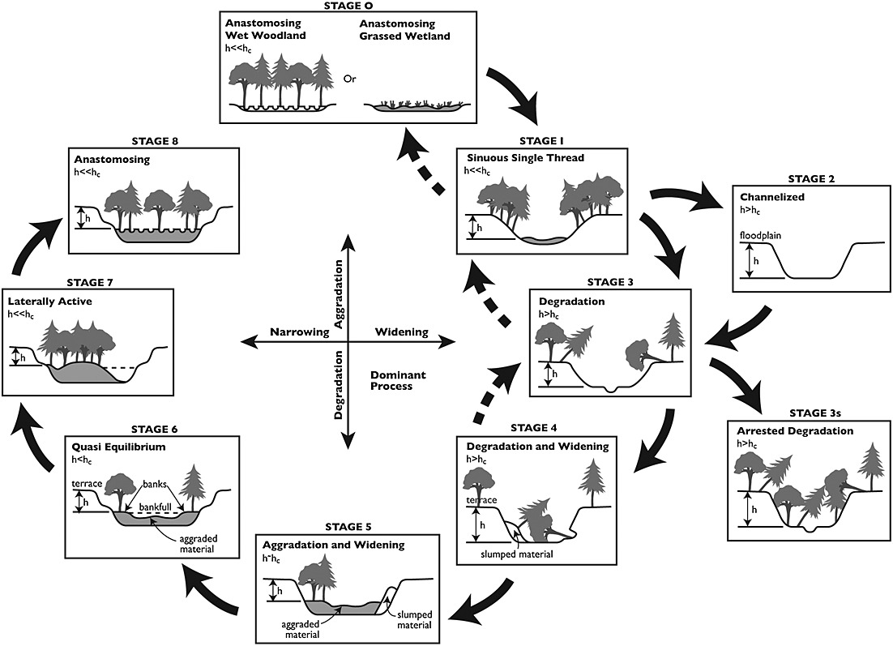
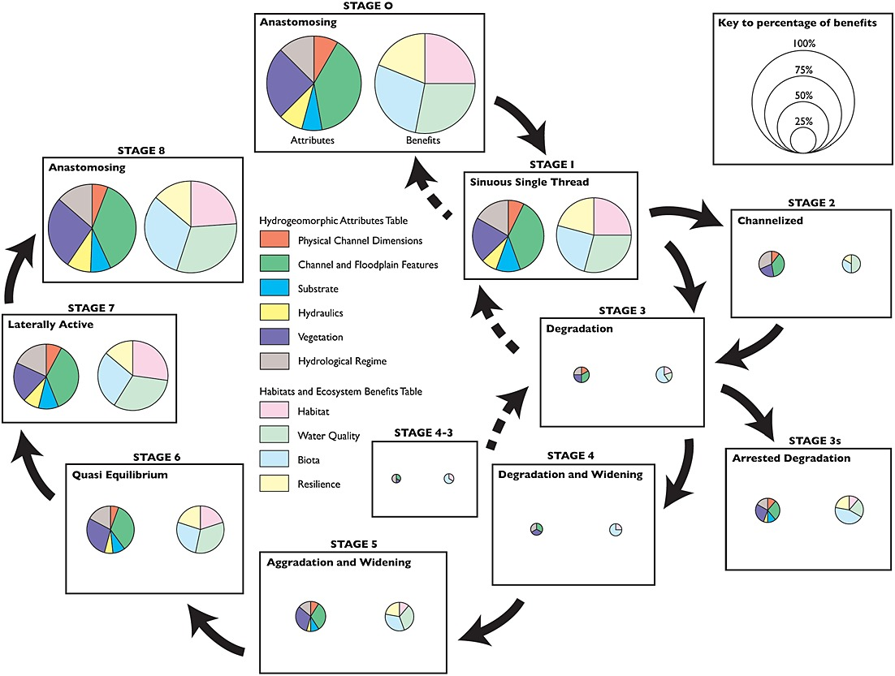

# Background

## Stage 0
The Stream Evolution Model (SEM) is used to understanding how the morphology of channels (such as rivers or streams) respond to disturbances like changes in base level, channelization, or alterations in flow and sediment regimes (Figure 1)[@cluerSTREAMEVOLUTIONMODEL2014]. An important features of the SEM is the inclusion of stage 0, which represents the state of the river before disturbances and is categorized as either an anastomosing wet woodland or an anastomosing grassed wetland (Figure 1) [@cluerSTREAMEVOLUTIONMODEL2014].



<br>

The SEM also assigns a hydrogeomorphic attributes and habitat and ecosystem benefits score to each stage (Figure 2). Stage 0 is the ultimate restoration goal, but the SEM suggests that there is a big difference in performance between disconnected and incised streams (stages 3-6) and connected streams (stages 7-1), and that stages 7-1 are the best targets for restoration because they have the highest ecosystem potential (Figure 2)[@cluerSTREAMEVOLUTIONMODEL2014].




<br>

## Process-based Restoration

Process-based restoration is a relatively new approach to river restoration and is based on the understanding that river form and function is driven by the physical, chemical, and biological processes that take place within them [@beechieProcessbasedPrinciplesRestoring2010]. Together, these processes shape rivers and flood planes, which is known as a riverscape [@shahverdian_etal2019ChapterBackground]. The goal of process-based restoration is to restore these processes to their the natural rates and magnitudes (essentially stage 0), which leads to the system restoring itself through biological processes and requires minimal corrective intervention [@ciottiDesignCriteriaProcessBased2021a, @polvi_wohl2013BioticDrivers]. This approach is in contrast to traditional river restoration, which focuses on restoring uniform and static form to the river, such as the channel shape, and is often done through hard engineering and has high costs [@beechieProcessbasedPrinciplesRestoring2010]. 

Below is an example of process-based restoration using stage 0 methodology done in at Deer Creek in Oregon, USA. In this project they filled in incised channels and added large wood to to the river to restore the natural floodplain elevation and re-establish multiple channels (Figure 4)[@meyer2018DeerCreek]. Although this project used relatively aggressive restoration techniques, they observed immediate improvements and the benefits were self-sustaining (Figure 5)[@meyer2018DeerCreek].


<br>

Process-based restoration also includes many low-cost and low-tech restoration techniques. Resources are sourced from near-by areas, and the restoration is often done by hand, which makes it more accessible to a broad audience and can be done on a smaller scale [@shahverdian_etal2019ChapterBackground]. The primary goal of low-tech restoration is to improve the health of as many riverscapes possible by "letting the system do the work" [@shahverdian_etal2019ChapterBackground].

Low-cost process-based restoration could be an applicable in the Upper Bulkely riverscape. Some examples of low-cost restoration techniques include:

* Grazing management
* Riparian planting
* Post-assisted log structures (PALS)
* Beaver damn analogs (BDAs)

[QGIS Riverscapes Studio](https://qris.riverscapes.net/) (or QRis) is a free plugin for QGIS that helps you digitize your riverscape data. QRis is a great planning tool for helping users with spatial representation of riverscapes. 


## Project Location

```{r overview-map, fig.cap = 'Overview map of Study Areas',eval=T}
knitr::include_graphics("fig/nge-icon_name.png")
```

<br>

```{r hydrology-plot, fig.cap = 'Hydrograph for Bulkley River at Quick (Station #08EE004) and near Houston (Station #08EE003).', fig.show="hold", out.width= c("49.5%","1%","49.5%"), eval=T}
knitr::include_graphics("data/TimePhoto_20220814_112459.jpg")
knitr::include_graphics("fig/pixel.png")
knitr::include_graphics("data/TimePhoto_20220814_112923.jpg")
```


`r if(gitbook_on){knitr::asis_output("<br>")} else knitr::asis_output("<br><br><br><br>")`


